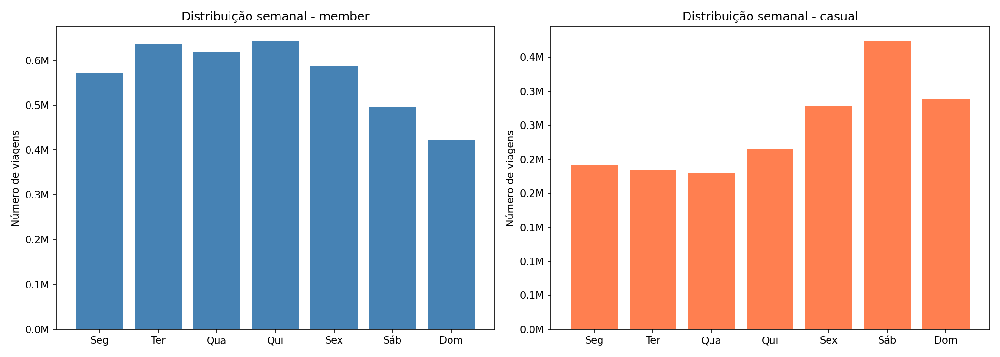
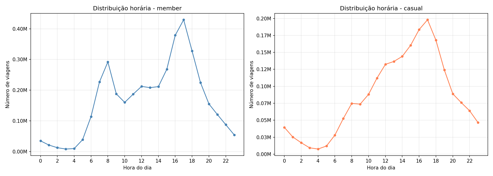
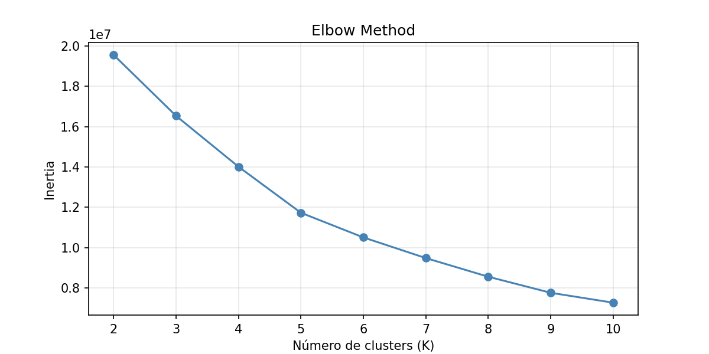
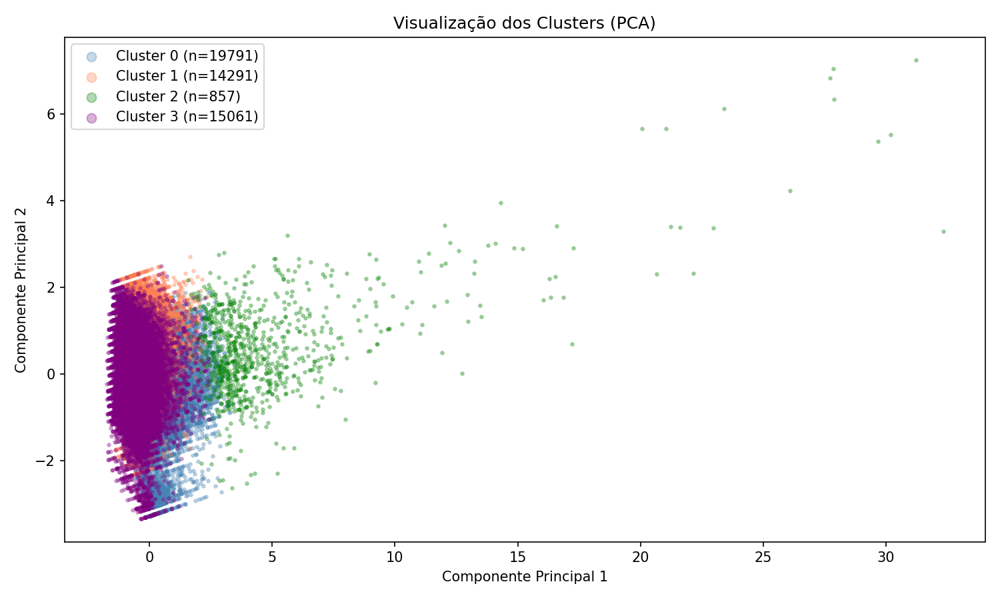

# 🚲 Divvy Bike Segmentation

> Segmentação de usuários do sistema de bicicletas compartilhadas de Chicago com K-means, identificando perfis de comportamento e gerando recomendações acionáveis para operação e marketing.

   

---

## 📌 Visão geral

A Divvy usa uma separação de usuários bem comum e muito utilizada nas empresas, sendo membro e casual. Membros usam mais durante a semana; casuais, nos fins de semana. Não é uma distinção errada, mas também não é precisa o suficiente para tomar decisões.

Um morador que usa o plano casual no fim de semana e um turista pedalando 90 minutos são tratados como iguais, por conta da distinção de membro e casual. Isso só gera campanhas de marketing genéricas sem uma conversão real de usuários e distribuição de bikes mal alocadas.

Analisando cerca de 6 milhões de viagens entre 2025 e 2026, foi encontrado que existem, na realidade, quatro tipos de usuários — sendo a divisão mais importante, sazonalidade vs. intenção de uso.

| Cluster | Perfil | Característica principal |
|---|---|---|
| 🚴 Explorador de FDS no Verão | Fins de semana, verão | Candidato ideal à conversão para membro |
| 💼 Commuter de Verão | Dias úteis, picos 8h e 17h | Demanda previsível, precisa de oferta garantida |
| 🗺️ Turista/Aventureiro de Verão | 90 min medianos, 80% casual | Não vai virar membro — produto diferente |
| ❄️ Trabalhador do Inverno | Pedala quando os outros somem | O mais leal — merece fidelização |

Tratar usuários apenas como membros e casuais causa uma alocação errada de recursos. Ignorar o Trabalhador do Inverno é perder o tipo de usuário mais leal. Agora que sabemos quais são os verdadeiros usuários, podemos definir quais são as prioridades para a empresa.

A seguir, os detalhes metodológicos e os resultados completos da análise.

---

## 💡 Recomendações de negócio

**Cluster 0 — Explorador de FDS no Verão**
Redistribuir bikes para estações próximas a parques e à orla do lago Michigan nos fins de semana de junho a agosto, período de maior concentração desse perfil.

**Cluster 1 — Commuter de Verão**
Garantir disponibilidade de bikes — preferencialmente elétricas — nas estações de maior fluxo em dias úteis de verão, especialmente nos picos das 8h e 17–18h, para atender o deslocamento casa-trabalho sem ruptura de oferta.

**Cluster 2 — Turista/Aventureiro de Verão**
Com 80% de usuários casuais e duração mediana de 90 minutos, este cluster representa a maior oportunidade de conversão para membro. Recomenda-se criar passes de verão ou planos de curta duração direcionados a esse perfil.

**Cluster 3 — Trabalhador do Inverno**
É o cluster mais leal do sistema — pedala quando os outros somem. Merece programa de fidelização com benefícios exclusivos para membros ativos no período frio, como desconto na renovação anual ou upgrades de plano.

---

## 📦 Dataset

| Item | Detalhe |
|---|---|
| Fonte | [Divvy Trip Data](https://divvy-tripdata.s3.amazonaws.com/index.html) (público) |
| Período | Janeiro 2025 – Março 2026 (15 meses) |
| Volume original | 6.209.268 viagens |
| Volume após limpeza | 6.036.885 viagens |
| Colunas principais | `ride_id`, `rideable_type`, `started_at`, `ended_at`, `start/end_station`, `start/end_lat/lng`, `member_casual` |

---

## 🛠️ Metodologia

### 1. Limpeza e tratamento

- Conversão de `started_at` e `ended_at` para `datetime`
- Criação da flag `has_station` para identificar viagens em sistema flex (elétricas sem docking em estação) — representa ~33% das viagens em ambos os perfis, sem diferença significativa entre membro e casual
- Remoção de 6.143 linhas com coordenadas de destino nulas (0,1% do total)
- Filtragem de duração: mantidas viagens entre **1 minuto e 12 horas**, com base na maior trilha registrada em Chicago (~90 km, ~5h, com margem para pausas)
- Removidas ~172k linhas (2,8% do total), todas justificadas

### 2. Feature engineering

| Feature | Descrição |
|---|---|
| `duration_min` | Duração da viagem em minutos |
| `hour` | Hora de início da viagem |
| `day_of_week` | Dia da semana (0 = segunda, 6 = domingo) |
| `month` | Mês de início da viagem |

`member_casual` e `rideable_type` foram excluídas do modelo: a primeira introduziria viés direto na segmentação; a segunda reflete disponibilidade de frota, não escolha do usuário.

### 3. Normalização

Aplicado `StandardScaler` para equalizar escalas entre as features antes do K-means. Resultado verificado: média ≈ 0 e desvio padrão ≈ 1 para todas as colunas.

### 4. Segmentação com K-means

Número de clusters definido pelo **Elbow Method** (K=2 a K=10). A inflexão mais clara ocorre em K=4, confirmada pela interpretabilidade dos clusters resultantes.

---

## 📊 Resultados

### Hipóteses testadas

| Hipótese | Resultado |
|---|---|
| Casuais concentram uso no fim de semana | ✅ Confirmada — sábado é o pico absoluto |
| Membros concentram uso nos dias úteis | ✅ Confirmada — padrão flat seg–qui com queda no FDS |
| Casuais têm maior duração mediana por viagem | ✅ Confirmada — 11,6 min vs 8,6 min |
| Membros têm maior volume semanal total | ✅ Confirmada — ~4M vs ~2M viagens |
| Membros têm padrão horário bimodal (8h e 17–18h) | ✅ Confirmada — commuter pattern clássico |
| Casuais têm padrão horário unimodal crescente até 17h | ✅ Confirmada |
| Casuais usam mais o sistema flex (sem estação) | ❌ Refutada — proporção idêntica (~33%) em ambos os perfis |

### Gráficos

**Distribuição semanal por perfil**



**Distribuição horária por perfil**



**Elbow Method**



**Visualização dos clusters (PCA)**



### Perfis identificados

| Cluster | Nome | Viagens | Duration mediana | Hora mediana | Dia mediano | Mês mediano | % Casual |
|---|---|---|---|---|---|---|---|
| 0 | Explorador de FDS no Verão | 2.385.683 | 10,5 min | 15h | Sábado | Agosto | 42% |
| 1 | Commuter de Verão | 1.718.437 | 9,4 min | 16h | Terça | Agosto | 30% |
| 2 | Turista/Aventureiro de Verão | 99.411 | 90,2 min | 14h | Quinta | Julho | 80% |
| 3 | Trabalhador do Inverno | 1.833.354 | 7,9 min | 14h | Quarta | Março | 25% |

**Insight central:** o sistema Divvy tem dois eixos de segmentação — sazonalidade e intenção de uso. Ignorar a sazonalidade leva a decisões operacionais equivocadas: o mesmo usuário casual se comporta de forma completamente diferente em julho e em março.

---

## 🚀 Como executar

### Pré-requisitos

```bash
pip install pandas matplotlib seaborn scikit-learn jupyter
```

### Estrutura do projeto

```
divvy-bike/
│
├── charts/           ← imagens geradas
│
├── data/
│   ├── raw/          ← CSVs originais da Divvy (não versionados)
│
├── notebooks/
│   ├── divvy_analysis.ipynb
│
└── README.md
```

### Execução

```bash
git clone https://github.com/joao-gabriel-barbara/divvy-bike-segmentation
cd divvy-bike
jupyter notebook notebooks/divvy_analysis.ipynb
```

> Os arquivos de dados brutos devem ser baixados diretamente em [divvy-tripdata.s3.amazonaws.com](https://divvy-tripdata.s3.amazonaws.com/index.html) e colocados em `data/raw/` antes de executar os notebooks.

---

## 👤 Autor

Feito por **João Gabriel Barbara** · [LinkedIn](https://www.linkedin.com/in/jo%C3%A3o-gabriel-barbara-336554232/) · [GitHub](https://github.com/joao-gabriel-barbara)
